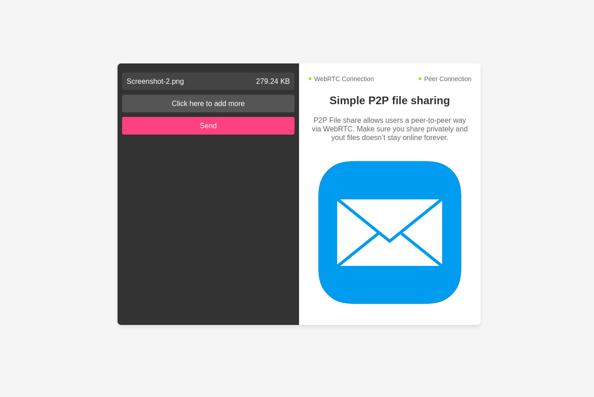

P2P file sharing using WebRTC
======================

This is a application to share files using webRTC

## Usage

Clone and install project dependecies using npm or yarn 

`` yarn install ``

once that is done you can run it on your local machine

`` yarn start ``

## Development

you can run the project in dev mode including both server and front-end code

`` yarn dev ``

you can also run the client or the server independently in dev mode

`` yarn dev:client ``

`` yarn dev:server``

## Tech Stack

P2P-File-Share is built using the following technologies:

- **Node.js**: Manages signaling and serves the client-side application.
- **Socket.IO**: Functions as the signaling server for establishing peer connections.
- **Simple-Peer**: Facilitates WebRTC connections for direct peer-to-peer file transfers.
- **React.js**: Front-end library provding the user interface
